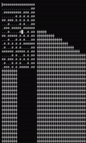

# Unicode Maze-runner

## 1. <b>서문</b>

콘솔에 유니코드를 이용해 3D 미로를 만들어주는 프로그램. Youtube 채널 "javidx9"이 그의 영상에서 작성한 코드를 참고하여 작성하였으며, 해당 영상에는 Raycasting에 대한 내용만 단 하나의 함수로(!) 구현 되어 프로그램의 구조 설계나 타이틀 스크린의 구현, 미로의 생성, 미니맵 기능의 개선 등은 본인이 직접 했다. "C++로 평면 화면 상에 3D 공간을 어떻게 그려낼 수 있을까?"라는 단순한 호기심에 시작했다. 프로그램을 처음 생각했을 당시에는 대차게 아스키 코드만으로 표현해보려고 했지만 명암 차이의 한계와 가독성으로 인해 유니코드를 적극적으로 활용하게 되었다.

소스코드를 작성하면서 게임, 특히 그래픽스 분야가 고도의 수학적 지식이 필요한 분야라는 인상을 받았다. 왜냐하면 평면 모니터 상에 3차원의 공간을 담으려면 물체의 거리와 각도에 따라 그 물체가 어떤 형상으로 보일지를 모두 계산해내야 하기 때문이다.

프로그램은 기본적으로 게임의 문맥(Context)들과 각 문맥들이 활용하는 CommonLib로 구성 되어 있으며, 싱글톤과 팩토리 패턴, State 패턴 등의 디자인 패턴이 활용되었다. naming convention은 Google C++ style guide를 따랐다.

미로는 새 게임이 시작될 때마다 랜덤으로 생성되고, 랜덤 미로를 생성하기 위해 Hunt and kill algorithm이 사용 되었다. 다른 알고리즘도 있지만 이 알고리즘을 예전에 공부했던 적이 있기 때문에 굳이 다른 방식은 찾아보지 않았다.

게임은 미로의 끝(미니맵의 최우하단)에 다다르면 다음 스테이지로 넘어가게 되어 있고, 미로 사이즈는 스테이지를 넘어감에 따라 더 커진다. 다만 미로가 커지더라도 미니맵은 17x17 사이즈로 고정되어 있고 플레이어를 중심으로 움직인다. TAB키를 누르고 있는 동안은 맵이 확대 되어 full size의 맵을 볼 수 있도록 구현했다. (2. 조작법 참조)

한편 몇몇 줄의 코드는 더 나은 코드를 고민할 거리가 되기도 했는데, 가령 벽의 바운더리를 그리는 알고리즘은 참고가 된 영상의 방법이 너무 복잡한데다가 항상 완벽하게 화면상의 바운더리를 잡아주지는 못한다는 단점도 가지고 있었기 때문에, 후술할 몇번의 시행착오를 거쳐 현재의 코드 처럼 간단하면서도 비교적으로 안정적인 형태가 되었다.


## 2. <b>조작법</b>

프로그램을 시작하면 타이틀 스크린이 나온다. 이 때 방향키로 커서를 이동할 수 있고, 엔터를 누르면 해당 메뉴를 선택하게 된다. START를 선택하면 게임이 시작된다.

게임이 시작되면 W/S/A/D로 캐릭터를 이동할 수 있고, 마우스로 시선을 회전 시킬 수 있다.

스테이지가 지남에 따라 미로는 점점 더 커지기 때문에, 미니맵에 맵의 전체 정보가 담기지 않는다. 캐릭터를 중심으로 미니맵의 크기만큼 출력이 되고, TAB 키를 누르고 있으면 full size의 맵을 볼 수 있다.



게임을 도중에 끝내고 싶으면 ESC 키를 누르면 된다. 다만, 게임을 도중에 종료하고 다시 시작하면 첫 스테이지부터 다시 시작해야 한다.

## 3. <b>소스 코드에 대한 설명</b>

### <b>3-1. Game 클래스</b>

최상위 클래스는 Game이다. Game은 (게임 플레이, 타이틀 화면 등과 같은) Context를 ContextFactory로부터 생성하여 가지고 있으며, Launch() 함수는 팩토리로부터 current_context_state_에 맞는 Context를 실제로 실행(Run)시키는 역할을 한다.

```c++
Game::Game()
{
	auto& factory = ContextFactory::GetInstance();
	for (int state = 0; state < static_cast<int>(ContextState::kContextStateMaxSize); state++)
	{
		// 등록되어 있는 모든 제품을 생산해서 context_에 넣는다.
		context_.push_back(factory.CreateContext(static_cast<ContextState>(state)));
	}
	current_context_state_ = context_[static_cast<int>(ContextState::kContextTitleScreen)];
}
```

```c++
void Game::Launch()
{
	// 프로그램 종료(kContextExit)가 선택될 때까지 do-while 루프를 돌며
	// 유저에 의해 선택된 Context의 Run() 함수 호출
	ContextState next_state = ContextState::kContextTitleScreen;
	do
	{
		current_context_state_ = context_[static_cast<int>(next_state)];
		next_state = current_context_state_->Run();
	} while (next_state != ContextState::kContextExit);
}
```

### <b>3-2. ContextFactory 클래스와 팩토리 패턴의 구현</b>

ContextFactory는 싱글톤으로 구현 되어 있다. 각 Context의 생성 함수 포인터를 보관해 두는 create_map_을 멤버 변수로 가지고 있고, 제품 등록(Register)을 통해 create_map_에 새로운 제품(Context)을 등록한다.

```c++
typedef unique_ptr<IContext>(*CREATOR)();

class ContextFactory
{
	MAKE_SINGLETON(ContextFactory) // 객체 생성 공장은 하나만 있어야 한다.
public:
	unique_ptr<IContext> CreateContext(ContextState context_state)
	{
		unique_ptr<IContext> ptr = nullptr;
		auto ret = create_map_.find(context_state);

		if (ret == create_map_.end()) return nullptr;

		ptr = create_map_[context_state](); // 제품을 주문 받으면 등록된 제품 중 주문이 들어온 제품을 반환해준다.

		return ptr;
	}

	void Register(ContextState context_state, CREATOR f) // 제품 등록
	{
		create_map_[context_state] = f;
	}
private:

	map<ContextState, CREATOR> create_map_;
};
```

Factory 패턴의 핵심은 새로운 제품이 생겼을 때(새로운 기능이 추가 되어 Context 종류를 늘려야 할 때) "해당 제품에 대한 코드만 추가하고, 기존의 코드는 수정하지 않아도 되는" 특장점이다. 즉, OCP를 만족할 수 있어야 하는데, 그러기 위해서는 제품을 공장에 등록하는 과정도 자동화가 되어야 한다. 이것을 자동으로 해주는 클래스가 FactoryRegister이다. FactoryRegister는 생성자에서 인자로 받은 함수를 공장에 등록해준다. <b><u>따라서 각 Context 클래스를 만들 때 객체 생성 함수와 FactoryRegister 객체를 static으로 멤버 함수/변수로 가지고 있기만 하면 그 제품(Context)이 자동으로 공장에 등록되어, 기능의 확장에는 열려 있고 불필요한 소스 코드의 수정에는 닫혀 있는(OCP) 구조가 된다.</u></b> 새로운 Context를 추가 하고 싶을 때는 해당 Context의 내용만 추가하면 되지, 객체 생성에 대한 어떠한 코드 수정도 필요하지 않다.

```c++
class FactoryRegister
{
public:
	FactoryRegister(ContextState context_state, CREATOR creator)
	{
		auto& factory = ContextFactory::GetInstance();
		factory.Register(context_state, creator);
	}
};
```

각 컨텍스트 구현 시 공장에 자동 등록 및 객체 생성을 하기 위해 필요한 코드는 아래와 같이 매크로로 작성하였다. 각 Context에서는 아래의 코드를 그대로 가져와 쓰기만 하면 별다른 코드 수정을 하지 않아도 Game 클래스가 그 제품(Context)을 context_ 벡터에 담고 있을 것이다.
```c++
#define DECLARE_CONTEXT_FACTORY(class_name)								   \
public:																	   \
	static unique_ptr<IContext> Create() { return make_unique<class_name>(); } \
	static FactoryRegister rs;

#define IMPLEMENT_CONTEXT_FACTORY(context_state, class_name)			   \
FactoryRegister class_name::rs(context_state, &class_name::Create);
```

### <b>3-3. Context 클래스</b>

모든 Context는 인터페이스인 IContext를 상속받은 클래스로서, 프로그램의 각 문맥을 의미한다. 현재 버전을 기준으로 게임 플레이 문맥인 ContextGamePlay, 메뉴 화면 문맥인 ContextTitleScreen으로 구성되어 있다. 각 문맥의 실질적인 기능에 대한 Execution은 Run 함수가 담당한다. Run은 IContext에서 순수 가상 함수로 선언되어 있어 반드시 override 해야 한다.

```c++
class IContext
{
public:
	virtual ContextState Run() = 0;
```

#### <b>3-3-1. ContextTitleScreen</b>
타이틀 화면 문맥 클래스. 프로그램 실행 시 처음 보이는 화면이기도 하다. Cursor 객체를 멤버 변수로 가지고 있고, 사용자의 방향키 조작에 따라 커서를 움직일 수 있다. 아래에 작성한 코드와 같이 엔터를 눌렀을 때 커서의 위치에 따라 해당 Context state를 반환하여 유저로부터 선택된 Context가 실행될 수 있도록 한다.

```c++
if (GetAsyncKeyState(VK_RETURN) & 0x8000)
{
    switch (current_cursor_pos)
    {
    case (int)TitleScreenText::kStart :
        return ContextState::kContextGamePlay;

    case (int)TitleScreenText::kExit :
        return ContextState::kContextExit;

    default :
        return ContextState::kContextExit;
    }
}
```

#### <b>3-3-2. ContextGamePlay</b>
게임 플레이 문맥 클래스. 스테이지에 맞는 랜덤 맵 생성(물론 정말로 맵을 생성하는 클래스는 MapCreator이지만), Ray casting, 플레이어 조작, 스테이지 이동이 모두 이 클래스에서 실행된다.

설명하고 싶은 것이 많지만 README에서는 지면 관계상 이 프로그램의 가장 핵심적인 기능 중 하나인 Raycasting에 대해서 설명한다. 이 프로그램에 쓰인 Raycasting 기법은 "Wolfenstein(울펜슈타인)"에서 구현된 방법과 같으며, field of view(FOV, 이 프로그램에서는 pi/4로 고정 되어 있다.)를 스크린의 Width 개수 만금 쪼갠 다음 거리를 계산하고 픽셀 하나 하나를 그려나간다. Raycasting이 실행 되는 과정은 아래와 같다.

1. FOV를 Screen width만큼 쪼갠다. 즉, 이 프로그램에서는 ( FOV / screen width)가 픽셀 한 컬럼이 된다. 이 세분화된 각도를 ray_angle 이라는 이름의 변수로 두었다.
2. ray_angle의 cos/sin Unit vector로 eye_x, eye_y를 둔다.
3. 플레이어의 위치에서 eye_x, eye_y만큼 점점 멀리 이동시켜 보면서 distance_to_wall을 계산한다. 마침내 벽에 부딪히면 해당 ray_angle에서는 distance_to_wall만큼 플레이어로부터 벽의 거리가 있다고 간주한다. 만약 최대 깊이인 depth까지도 벽에 도달하지 못하면 distance_to_wall은 depth로 한다.
4. distance_to_wall에 따라 바닥면과 천장면의 높이를 계산한다. 벽이 멀리 있으면 멀리 있을수록 천장과 바닥은 화면의 가운데(screen height의 가운데)로 오게 되고, 벽이 가까이 있으면 가까이 있을 수록 벽이 크고 바닥면과 천장은 보이지 않게 된다.
5. distance_to_wall에 따라 shade를 고른다. 멀리 있을 수록 연한 색의 유니 코드 문자로 출력한다.
6. 1~5를 반복하여 전체 screen에 대한 ray casting이 구현되면 한 프레임을 화면 상에 출력한다.

## 4. <b>기능 구현에 대한 고민거리들</b>

### 4-1. <b>벽의 바운더리 표현 </b>
처음 이 프로그램을 개발할 때는 벽의 바운더리를 구현하지 않았다. 참고 영상에서는 벽의 바운더리를 표현하고 있었는데, 나는 벽의 바운더리가 프로그램 개발에 큰 비중을 차지하는 것도 아니고, 그다지 의미 있는 기능도 아니라고 생각했기 때문이다.

하지만 막상 Raycasting을 구현해보고 나니 왜 벽의 바운더리를 표현해야 하는지에 대한 필요성을 느낄 수 있었다. <b>콘솔에 유니코드로 좁디 좁은 3D 공간을 표현하다 보면 당연히 가독성은 매우 낮을 것이고, 벽이 가까이 있을 때는 온 스크린이 흰색으로 비쳐 화면을 회전하더라도 플레이어가 회전하고 있는지조차 인식할 수 없었다.</b>

그 뒤에야 참고 영상을 보면서 벽의 바운더리를 어떻게 표현하면 되는지 살펴보게 되었는데, 참고 영상에서 쓰인 방법의 골자는 아래와 같다.

1. raycasting을 진행할 때, 벽을 조사하면서 각 픽셀이 "어떤 벽에 부딪히는지" 알 수 있다.
2. 그 벽은, 정육면체이므로 4개의 모서리를 가지고 있다.
3. 플레이어에게는 이 중 각도에 따라 정면이면 2개, 아니면 3개가 보일 것이다.
4. 플레이어로부터 이 4개의 모서리에 대한 거리를 모두 계산한다. 그리고 그 중 2개 또는 3개로 고정된 수의 모서리만 표현한다.

참고 영상의 말미에는 위 방법의 치명적인 문제를 직접 거론하고 있었는데, 내가 생각한 문제점과 같았다. 간단히 정리하면 아래와 같다.

1. 바운더리 표현만을 위해 사용되는 수식이 너무 복잡하다.
2. 표현할 바운더리(모서리)를 2개로 고정하면, 벽의 정면을 바라볼 때는 괜찮지만 비스듬하게 정육면체를 바라볼 때는 3개의 모서리가 보인다. 프로그램은 2개의 모서리만 바운더리로 표현하므로 나머지 1개의 바운더리는 표현하지 못한다.
3. 표현할 바운더리를 3개로 고정하면, 반대로 2개의 모서리만 표현해야할 때 시야에는 있지도 않은 나머지 하나의 모서리마저 검게 표현해버린다.

위의 방법은 복잡할 뿐만 아니라, 벽의 바운더리도 제대로 표현하지 못한다는 면에서 내키지 않았다. 그 때 내 머릿속을 스쳐간 생각이 있었는데, 바로 이거였다.

>"distance_to_wall을 계산하면서 이미 벽의 위치와 픽셀의 위치를 알고 있잖아?"

그렇다. 프로그램은 아래와 같이 픽셀 하나하나를 그리면서 부딪히는 벽의 위치와, 표현하고자하는 픽셀의 좌표를 정확하게 알고 있다.
```c++
// 픽셀의 x좌표
double wall_pos_x = player.x_ + eye_x * distance_to_wall; 
// 픽셀의 y좌표
double wall_pos_y = player.y_ + eye_y * distance_to_wall;
```
따라서 벽 하나의 길이는 1이고, 벽(#)의 위치, 심지어 표현하고자 하는 픽셀의 위치마저 알고 있으니 벽과 픽셀의 거리를 계산했을 때 정육면체 모양 벽의 중심으로부터 1/sqrt(2) 만큼 떨어져 있으면 그것은 바운더리일 것이다!

```c++
// 벽(#)의 x좌표
test_x = static_cast<int>(std::round(player.x_ + eye_x * distance_to_wall));
// 벽(#)의 y좌표
test_y = static_cast<int>(std::round(player.y_ + eye_y * distance_to_wall));

//따라서 픽셀의 좌표와 벽의 중심의 거리가 1/sqrt(2)이면 바운더리이다.
1/sqrt(2) = sqrt(pow((double)test_x - wall_pos_x, 2) - pow((double)test_y - wall_pos_y, 2));
```
다만, 실제로는 정확히 1/sqrt(2)일 수 없고, 1/sqrt(2) == 0.70710... 이므로 아래의 수식을 사용하였다.

```c++

double distance_wall_core_wall_pos = sqrt(pow(static_cast<double>(test_x) - wall_pos_x, 2) + pow(static_cast<double>(test_y) - wall_pos_y, 2));
if (distance_wall_core_wall_pos > 0.60) is_boundary = true;
```

하지만 위 방법대로 구현했더니 다른 문제가 생겼다. 바운더리의 개수는 정확하게 시선에 맞게 처리가 되지만, 여전히 많은 변수를 수식에 집어 넣다 보니 바운더리의 두께가 상당히 불안정해서, 캐릭터가 회전하거나 조금이라도 움직이면 벽과 바운더리가 마치 춤을 추듯 진동하는 것이었다. 훨씬 더 간단한 방법을 찾아야 했다.


고민 끝에 가장 간단한 방법을 찾아냈는데, 그 방법은 아래와 같다.
```c++
double wall_pos_x_tenths = abs(wall_pos_x - round(wall_pos_x));
double wall_pos_y_tenths = abs(wall_pos_y - round(wall_pos_y));
if (wall_pos_x_tenths > 0.4 && wall_pos_y_tenths > 0.4) is_boundary = true;
```

지금까지 생각했던 벽(#)의 위치는 정확하게 소수점이 0이 되는 점이다. 즉, 정수 좌표에 #이 고정되어 있다. 그렇다면 #과 #의 사이는 0.5 단위일 테니, 대충 #으로부터 x좌표와 y좌표가 0.4 이상 떨어져 있기만 하면 그 점은 바운더리일 것이다.  결과는 아래의 그림과 같다.


이 방법은 어떤 수를 빼서 재곱을 하고 다시 루트를 씌우지도 않고, 참고 영상에서 처럼 보이지도 않아서 계산할 필요도 없는 모서리를 계산해낼 필요도, 보일 모서리를 계산하기 위해 모든 모서리를 구한 다음 정렬 함수를 호출할 필요도 없다. 그냥 소수점 첫째 자리가 정수로부터 0.4~0.5만큼 떨어져 있기만 하면 된다. 이렇게 해서 지금의 바운더리 표현이 완성 되었다.
